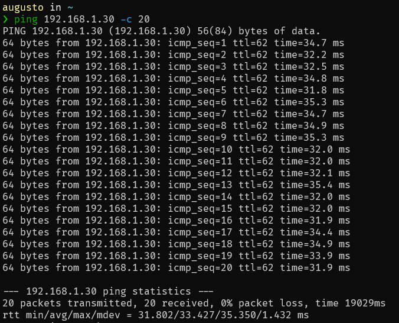
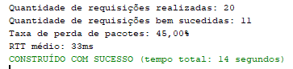
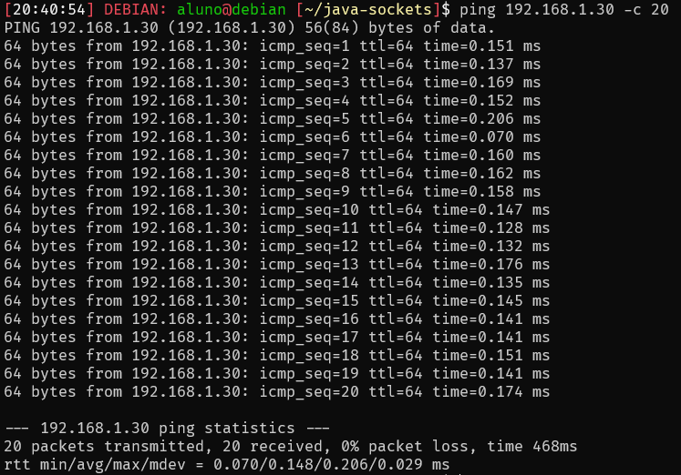
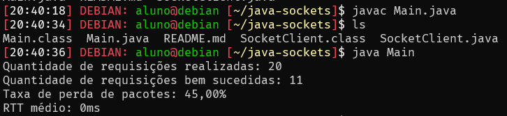

# Sockets com Java
Esse projeto foi desenvolvido para a disciplina de Redes de Computadores do curso de Sistemas de Informação na Universidade Federal de Lavras.

O objetivo foi desenvolver um cliente para conectar em um servidor utilizando sockets com comunicação UDP, calcular o RTT (Round Trip Time) e a taxa de perda de pacotes.

## Implementação
Foram utilizados 2 classes principais para a comunicação: DatagramPacket (um container para os dados) e DatagramSocket (um mecanismo para enviar e receber DatagramPackets). Para encapsular a lógica, criamos uma classe SocketClient, que possui os métodos para iniciar/encerrar a conexão e enviar dados.

Na classe Main implementamos o fluxo da comunicação: conectamos ao servidor, enviamos 20 requisições e desconectamos do servidor. Somamos os RTTs das requisições bem sucedidas e, por fim, calculamos as métricas.

## Resultados
Os acessos feitos via máquina virtual do laboratório apresentaram RTTs muito menores, vistos que a máquina está fisicamente na mesma rede do servidor. 

Os números podem ser vistos a seguir:

### Máquina Pessoal (Via VPN)
#### Ping

#### Sockets

### Máquina Virtual (Laboratório na UFLA)
#### Ping

#### Sockets

O resultado observado foi um RTT de 0ms, pois foram utilizados valores inteiros para armazenar o tempo, e ele foi menor do que 1ms.

## Membros do Grupo
- [Augusto César Rodrigues Lima](https://github.com/augustolimald)
- [Matheus Rocha Silva Pimenta](https://github.com/matheusrsp91)
- [Vinícius Antônio Carvalho Leite](https://github.com/Viniciud)

## Referências
[Java UDP Client Server Program Example](https://www.codejava.net/java-se/networking/java-udp-client-server-program-example)
